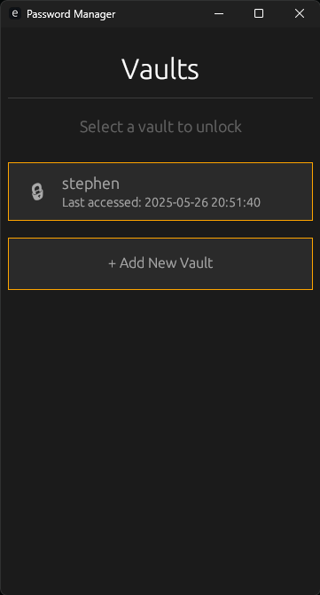
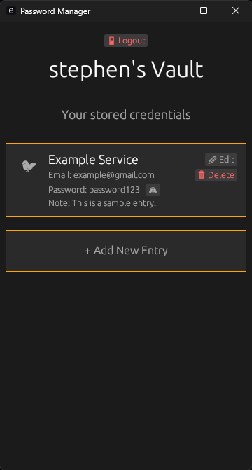

# 🔐 Password Manager

A simple, secure, and offline-first password manager built with Rust and [`egui`](https://github.com/emilk/egui). Easily store and retrieve encrypted credentials in a sleek, minimal UI.

---

## 🧭 Overview


This desktop application is built for Windows using native Rust technologies. It features:

- Encrypted vault storage
- Master password login
- Clean and responsive UI with `egui`
- No internet access or online syncing — 100% local
- Lightweight and fast

---

## 🔧 Features

- ✅ Simple & responsive GUI built with `egui`
- 🔐 End-to-end encryption using [ring](https://github.com/briansmith/ring)
- 🧂 Unique salt and nonce generation for every encryption
- 🔑 Password-derived keys using PBKDF2-HMAC-SHA256
- 🧠 All sensitive data kept in memory only for session duration
- 💡 Zero external dependencies for crypto — fully offline and local

---

<table> 
    <tr> 
        <td align="center"> 
             
            <br/>🔑 <strong>Login</strong> </td> <td align="center"> 
             
            <br/>🗂️ <strong>Vault Entries</strong> 
        </td>
    </tr> 
</table>

---

## 🔐 Encryption & Decryption:

This application uses the [`ring`](https://docs.rs/ring/) crate for modern, secure cryptography.

### Key Derivation
Passwords are **not** used directly as encryption keys. Instead, they are passed through a **key derivation function (KDF)**:

- 🔁 `PBKDF2` with `HMAC-SHA256`
- 🔢 100,000 iterations
- 🧂 A **random 16-byte salt** is generated per encryption

This ensures brute-force attacks are computationally expensive and prevents precomputed dictionary attacks.

```rust
pbkdf2::derive(
    pbkdf2::PBKDF2_HMAC_SHA256,
    NonZeroU32::new(100_000).unwrap(),
    salt,
    password.as_bytes(),
    &mut key,
);
```

### Encryption: ChaCha20-Poly1305 AEAD
ChaCha20-Poly1305 is an authenticated encryption algorithm providing both confidentiality and integrity.

Each encryption includes:

- A random 12-byte nonce

- Encrypted data + 16-byte authentication tag

- Final output: [salt][nonce][ciphertext + tag]

🔓 Decryption Flow
1. Extract salt, nonce, and ciphertext from encrypted buffer

2. Re-derive the key using the password and salt

3. Verify the authentication tag and decrypt

4. Return plaintext, or error if tampered or incorrect password

Once unlocked, the vault displays all stored credentials. Entries include:

- Website / App name
- Username or email
- Password (toggle visibility)
- Edit / Delete options

All data is stored locally and encrypted at rest using strong cryptographic primitives.

---

## 🛠️ Building from Source

To build this project, you'll need:

- [Rust](https://www.rust-lang.org/tools/install)
- Windows OS (GUI support currently Windows-only)

```bash
git clone https://github.com/your-username/password-manager
cd password-manager
cargo build --release
